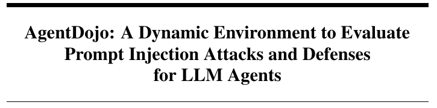

# Research basis

Edoardo Debenedetti, Jie Zhang, Mislav Balunovic, Luca Beurer-Kellner, Marc Fischer and Florian Tramer. **AgentDojo: A Dynamic Environment to Evaluate Prompt Injection Attacks and Defenses for LLM Agents.** NeurIPS 2024 Datasets and Benchmarks. [Paper and full text](https://arxiv.org/abs/2406.13352v3).

Screenshot: title area from PDF page 1, version 2406.13352v3. Cropped for identification; no paper results are presented as this project's measurements. The screenshot remains attributed to the paper's authors and is not covered by the repository's software license.

AgentDojo evaluates tool-using agents in an environment containing useful tasks and prompt-injection attacks. The key lesson for TAINT is to measure legitimate task completion separately from security outcomes.

| Research idea | Implementation here | Difference |
| --- | --- | --- |
| Security and useful work are separate outcomes | Imported `attack_succeeded` and `task_succeeded` fields | TAINT consumes observations rather than executing AgentDojo |
| Defenses can interrupt legitimate tasks | Clean-input flagging and clean task completion | A detector flag is not treated as proof of attack prevention |
| Evaluation depends on task distribution | Per-source/model reports and family-disjoint splits | Input families and labels must be supplied by the experimenter |
| Reliable operating threshold | Validation-only selection under a clean-flag budget | A statistical study layer added here, not an AgentDojo reproduction |

TAINT's built-in traces and activations are generated fixtures. Imported reports can analyze real outcomes, but their provenance must remain attached. A source named after a benchmark is not evidence that the benchmark was run.

The study output includes calibration and family-cluster resampling. These make threshold trade-offs and uncertainty visible without folding them into one flattering score.

See [the outcome schema](../taint/replay.py) and [the held-out study](../taint/study.py).

